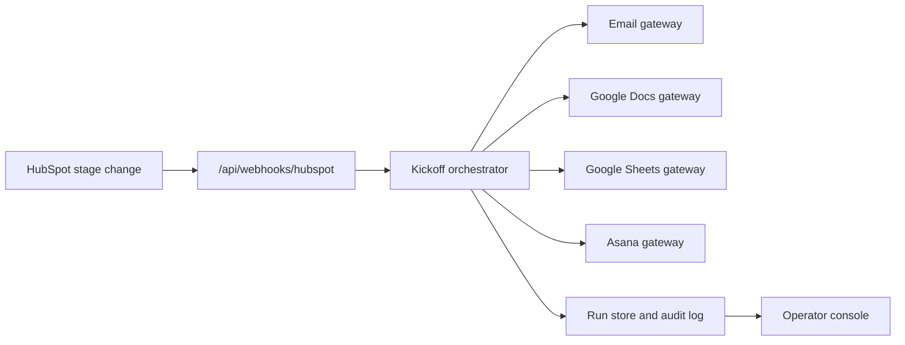

# Warren James Creator Kickoff Auto-Spinup

## Current-State Pain Points

- Kickoff work starts in HubSpot but spreads across email, docs, sheets, Asana, calendars, and decks.
- Executive context is manually rewritten, so important creator details can be delayed or lost.
- Biz Dev handoff quality depends on who creates the doc and how quickly they find the right template.
- Pod assignment has no guaranteed writeback trail at the moment the creator moves into execution.
- Launch project creation waits on a human even when the key setup data already exists.

## MVP Workflow

Trigger: a HubSpot webhook reports that the creator stage changed to `Kickoff`.

Automated steps:

1. Generate/send an executive kickoff email from creator metadata.
2. Create a Biz Dev handoff doc using a standard structure.
3. Write a pod-assignment request row to the team assignment sheet.
4. Create an Asana launch project from the launch template.

Human review remains explicit for pod owner assignment, launch-date changes, assortment approval, donation mechanics, and final external-facing materials.

The app now presents this as an operations command center rather than a one-off demo: run metrics, review queue, readiness signals, artifact inventory, and provider health all come from the same workflow state.

## Architecture

The orchestrator owns workflow order and error handling. Gateways own external side effects. The UI reads run state and can execute a manual dry run for demos.

## Productized Surfaces

- Overview: current workflow performance and selected run readiness.
- Review: human tasks created by automation, with explicit approval actions.
- Runs: audit-friendly execution history.
- Events: source webhook history, idempotency status, and related run pointers.
- Artifacts: all generated handoff links across runs.
- Integrations: environment and provider readiness across HubSpot, email, Google Docs, Google Sheets, and Asana.

## Success Metrics

- Time from HubSpot Kickoff transition to complete launch package.
- Percent of creators with executive email, handoff doc, assignment row, and Asana project created within five minutes.
- Reduction in missing handoff fields.
- Number of assignment rows waiting longer than one business day.
- Manual correction rate per artifact type.
